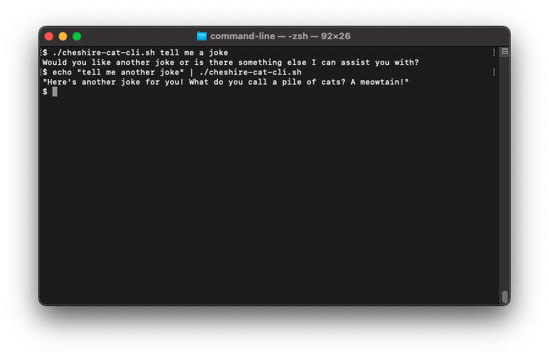
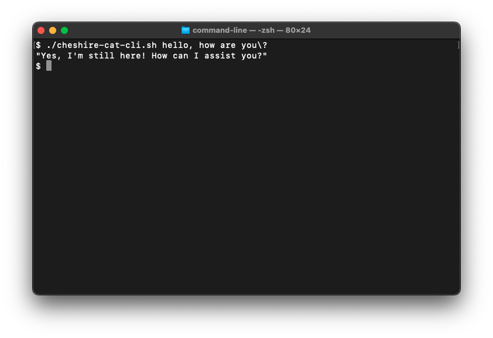

# cheshire-cat-adapters_command-line
## Cheshire Cat Command Line integration

This is a Command Line adapter to the [Cheshire Cat](https://github.com/pieroit/cheshire-cat) WebSocket. It is the refactoring of some code from the [siri-cheshire-cat](https://github.com/xdatap1/siri-cheshire-cat) Proof of Concept. It is more robust, since it pack everything on a single shell script.

### Requirements
* [websocat](https://github.com/vi/websocat) - Command-line client for web sockets [version 1.11.0]
* [jq](https://stedolan.github.io/jq/) - command line JSON processor [version 1.6]

### Usage
If you are on a Unix-like system you will need to grand execution permission with chmod

> chmod +x cheshire-cat-cli.sh

The script works with the prompt as parameter and in pipeline with another command, like in the following picture:

If you use special character in your prompt and you send it as parameters, do remember to escape them, like this example:

 
### Final Notes
This is just a Prof of Concept to demonstrate different way to interface Cheshire Cat, have fun, and learn new stuff. To get a little help, I must confess that I used ChatGPT. So the code might be redundant and not very elegant. Feel free to fork and adapt it as you prefer. It's not going to be maintained in any way.