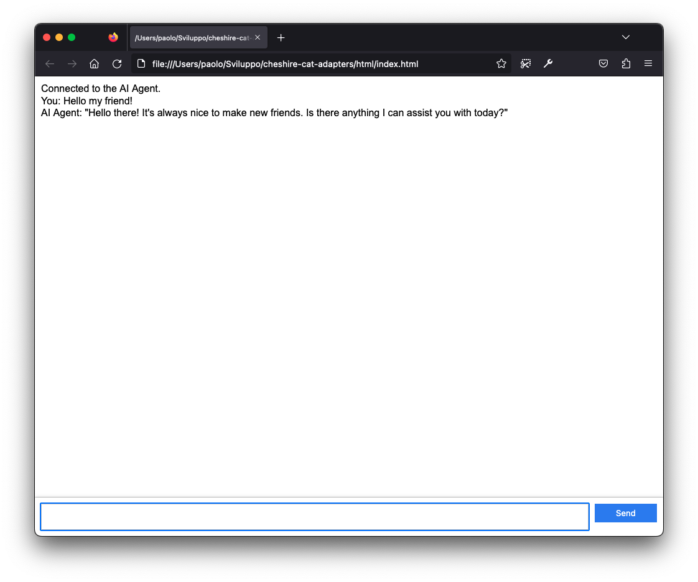
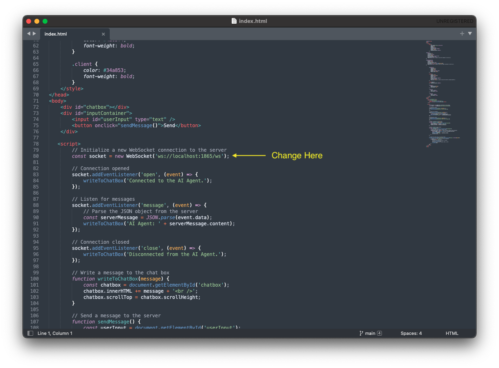

# cheshire-cat-adapters_html
## Cheshire Cat simple HTML client

This is a single-page application to interface [Cheshire Cat](https://github.com/pieroit/cheshire-cat) WebSocket. It could be used when developing a derivated application and needing a clean, more business-friendly web page to make a demo.

### Usage
Just Open **index.html** with your browser; it must run from the same machine where the Cheshire Cat backend runs.

If you use it from another machine, you need to update the Cheshire Cat IP Address by changing line 80, like this example:

 
### Final Notes
This is just a Prof of Concept to demonstrate different ways to interface with Cheshire Cat, have fun, and learn new stuff. To get a little help, I must confess that I used ChatGPT. So the code might be redundant and not very elegant. Feel free to fork and adapt it as you prefer. It's not going to be maintained in any way.
