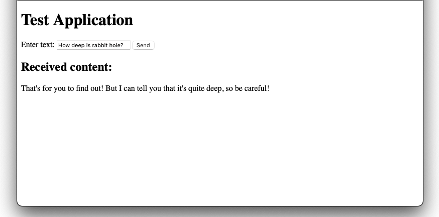

# cheshire-cat-adapters_rest-api
### A Rest API bridge to Cheshire Cat 

This is a REST API adapter to the [Cheshire Cat](https://github.com/pieroit/cheshire-cat) WebSocket. It is an evolution of the [cheshire-cat-web-bridge](https://github.com/xdatap1/cheshire-cat-web-bridge) Proof of Concept. It is more robust, since it uses [Waitress](https://pypi.org/project/waitress/) as WSGI server, instead of the Flask built-in server.

### Requirements
* Python
	* [Flask](https://pypi.org/project/Flask/)
	* [Flask-Cors](https://pypi.org/project/Flask-Cors/)
	* [websockets](https://pypi.org/project/websockets/)
	* [Waitress](https://pypi.org/project/waitress/)

### Installation

To install Python requirements, run

> pip install -r requirements.txt

And then run the app.py

> python3 wsgi.py

It will start listening at port 3500. To test it, just run open test.html with your browser. It should work as the following. If not, try to look for errors in the terminals.

 
### Final Notes
This is just a Prof of Concept to demonstrate different way to interface Cheshire Cat, have fun, and learn new stuff. To get a little help, I must confess that I used ChatGPT. So the code might be redundant and not very elegant. Feel free to fork and adapt it as you prefer. It's not going to be maintained in any way.