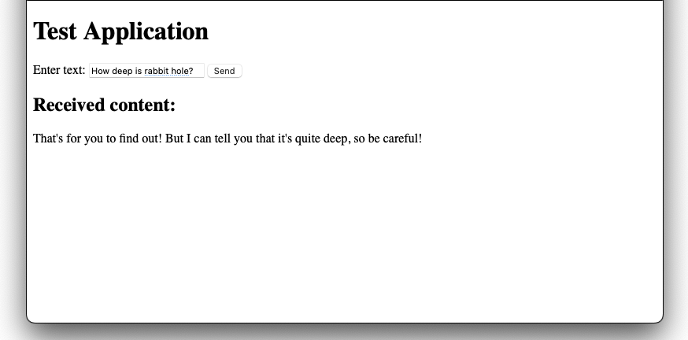
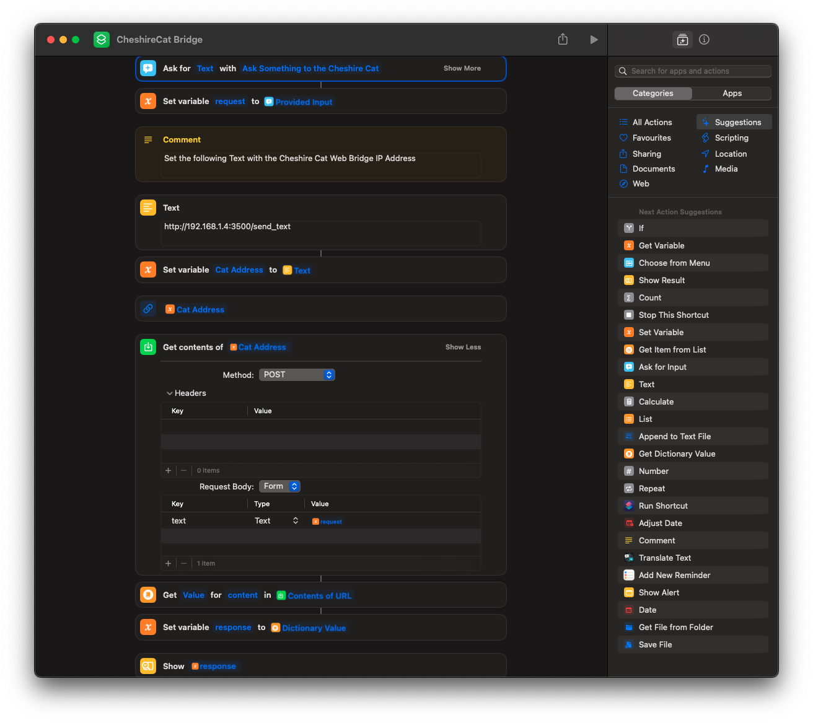

# cheshire-cat-adapters_siri
### An Apple's Siri adapter to Cheshire Cat

This is a proof of concept of a Apple Shortcut to interact Cheshire Cat from Siri. It is the refactoring of some code from the [siri-cheshire-cat](https://github.com/xdatap1/siri-cheshire-cat) and [cheshire-cat-web-bridge](https://github.com/xdatap1/cheshire-cat-web-bridge) Proof of Concepts. The code is more clean and robust, so this repository is to be considered the preferable version, whils the other two are to be considered deprecated.

### Requirements
* [Rest API Adapter](https://github.com/xdatap1/cheshire-cat-adapters/tree/main/rest-api)

### Installation

You need to install and run the [Rest API Adapter](https://github.com/xdatap1/cheshire-cat-adapters/tree/main/rest-api). As the first step be sure that it works, trying it with its **test.html** web page.

 
 If it works as expected, you can try the next step: make it work with Siri!
 
 Install the shortcut from [here](https://www.icloud.com/shortcuts/880466f7577e4bbf9325e2be38f3fb52). Open it; it should look like the following:
 
 
 
In order to make it work from any apple device in the local network, insert your IP address (in the example you will find 192.168.1.4).
 
This Siri shortcut works in both text and voice.
 
### Final Notes
This is just a Prof of Concept to evaluate Cheshire Cat interfacing from other applications, have fun, and learn new stuff. To get a little help, I must confess that I used ChatGPT. So the code might be redundant and not very elegant. Feel free to fork and adapt it as you prefer. It's not going to be maintained in any way.